```mermaid
---
config:
  layout: elk
---
flowchart TB
 subgraph Internet["Public Internet & Edge"]
        Users["End Users"]
        Slack["Slack Channel"]
        CloudflareEdge["Cloudflare Edge (DNS + SSL)"]
  end
 subgraph Repositories["Source Repositories"]
        Git["Infra & Code Repo"]
        Portfolio_Repo["Portfolio Site Repo (SHA Tags)"]
        Diagram_Repo["Diagram App Repo (SHA Tags)"]
        GitOps_Repo["GitOps Repo (Manifests)"]
  end
 subgraph CI_Pipeline["GitHub Actions: CI Workflow"]
        ALint["Ansible Lint"]
        Molecule["Molecule Testing"]
        CiCheck["Linter/Formatter/Portfolio Analysis/Audit"]
  end
 subgraph Matrix_Jobs["Build & Test Matrix (Frontend / Backend)"]
        Build_Local["1. Build Local Image"]
        Trivy["2. Trivy Security Scan"]
        Smoke_Run["3. Run Smoke Container"]
        Health_Check["4. Wait & Smoke Test"]
        Push_Multi["5. Push Multi-Arch Image (amd64/arm64)"]
        Cleanup["6. Post-Job Cleanup"]
  end
 subgraph Kustomize_Job["Update GitOps Manifests"]
        Clone_GitOps["Clone GitOps Repo"]
        Kustomize_Edit["Kustomize Set Image Tags"]
        Git_Push["Commit & Push to Main"]
  end
 subgraph CD_Pipeline["GitHub Actions: CD Workflow"]
    direction TB
        Trigger{"workflow_run: CI Completed"}
        Matrix_Jobs
        Kustomize_Job
  end
 subgraph GitHub_Platform["🐙 GitHub Platform Ecosystem"]
        Repositories
        CI_Pipeline
        CD_Pipeline
        GHCR["GitHub Container Registry (GHCR)"]
  end
 subgraph Automation["Automation Control Plane"]
        Makefile["make apply"]
        Ansible["Master Ansible"]
        Terraform["Master Terraform"]
        Kubectl["Kubernetes Control Plane (kubectl)"]
        Kubeconfig["kubeconfig"]
        DynamicInven["Dynamic Inventory"]
  end
 subgraph MainDevices["Management and Orchestration Nodes"]
        MainPC["MainPC"]
        MainLaptop["MainLaptop"]
        Automation
        SSH1["SSH Keys (PC)"]
        SSH2["SSH Keys (Laptop)"]
  end
 subgraph SSHD1["SSHD Hardening"]
        Access["SSH Completed"]
        APerms["No Root Login"]
        AKeys["No Key, No Entry"]
        UFW["Only allow Tailscale Devices"]
        Port22["Only on Port 22"]
        NoIP["No Local IP SSH"]
        F2B["Fail2ban"]
  end
 subgraph ObservabilityStack["Compose - Observability Stack (LGTM + Alloy)"]
        Alloy["Grafana Alloy :12345"]
        Prom["Prometheus :9090"]
        Loki["Loki :3100"]
        Tempo["Tempo :3200"]
        Grafana["Grafana Visualization :3030"]
        AManager["AlertManager :9093"]
        DLogs["Docker Logs"]
  end
 subgraph Docker["Docker Containers (Observability Experiments)"]
        ObservabilityStack
  end
 subgraph Pi5["Node - Raspberry Pi 5"]
        SSHD1
        Docker
  end
 subgraph Tailscale["Tailscale Mesh Network"]
        MainDevices
        Pi5
  end
 subgraph Portfolio_App["Portfolio Stack"]
        Portfolio_Frontend_Pod["Portfolio Frontend"]
        Portfolio_Backend_Pod["Portfolio Backend"]
  end
 subgraph Diagram_App["Migrated Diagram Stack"]
        Frontend2["React/Vite Frontend (Diagram)"]
        Backend2["Node JS Backend"]
  end
 subgraph Workloads["Namespaces and Pods"]
        Portfolio_App
        Diagram_App
  end
 subgraph DOKS["DOKS (3-Node Kubernetes Cluster)"]
        DO_API["DigitalOcean API"]
        ArgoCD["Helm: ArgoCD Operator"]
        Ingress["Helm: Ingress-NGINX Controller"]
        TunnelPod["Cloudflared Tunnel Pod"]
        DO_DB[("Managed PostgreSQL")]
        Workloads
  end
    Users --> CloudflareEdge
    Portfolio_Repo -. Dependabot .-> Portfolio_Repo
    Diagram_Repo -. Dependabot .-> Diagram_Repo
    Portfolio_Repo --> GitOps_Repo
    Diagram_Repo --> GitOps_Repo
    Git --> ALint & CiCheck
    ALint --> Molecule
    Build_Local --> Trivy
    Trivy --> Smoke_Run
    Smoke_Run --> Health_Check
    Health_Check --> Push_Multi
    Push_Multi --> Cleanup
    Clone_GitOps --> Kustomize_Edit
    Kustomize_Edit --> Git_Push
    Trigger -- if CI Success --> Matrix_Jobs
    Matrix_Jobs -- needs --> Kustomize_Job
    CI_Pipeline -. Triggers .-> Trigger
    Push_Multi -- Pulls / Pushes --> GHCR
    Git_Push -- Updates --> GitOps_Repo
    Makefile --> Terraform & Ansible
    Kubectl --> Kubeconfig
    Terraform --> Kubeconfig & DynamicInven
    Ansible --> DynamicInven
    MainPC --> SSH1
    MainLaptop --> SSH2
    F2B --> NoIP
    NoIP --> Port22
    Port22 --> UFW
    UFW --> AKeys
    AKeys --> APerms
    APerms --> Access
    Alloy --> DLogs & Prom & Loki & Tempo
    Prom --> Grafana & AManager
    Loki --> Grafana
    Tempo --> Grafana
    SSH1 --> SSHD1
    SSH2 --> SSHD1
    Terraform -- Provisions Cluster and DB --> DO_API
    DO_API --> ArgoCD & Ingress & DO_DB
    GitOps_Repo --> ArgoCD
    ArgoCD --> Workloads
    Workloads -. "Self-Heal Control Loop" .-> ArgoCD
    Workloads -. Pulls Validated Images .-> GHCR
    CloudflareEdge -- Secure Tunnel --> TunnelPod
    TunnelPod --> Ingress
    Ingress --> Portfolio_Frontend_Pod & Portfolio_Backend_Pod & Frontend2 & Nodejs2
    Nodejs2 --> DO_DB
    AManager -- Webhook Alerts --> Slack


```

<!-- Header with dynamic stats and badges -->

  

<h1 align="center">Stephen Macabulos</h1>

  
  
  
  

  
  
  
  
  
  
  
  

  
  
  
  

---

## 🧑‍💻 About Me

Helloew!!!! It's an honor you stumbled upon my profile!
To sum it up, I am just a guy very obsessed with tech and infrastructure and that's what keeps me to do what I do.
I strive to be a person that people look up to and be the reason why they feel the hope in humans as in the current world <3

🎯 Current Goal:
- Experiment on 3 Way Distributed Database load test, indexing, and migration
- Applying High level System Design Concepts on Systems & Applications
- Studying networking to better understand how these systems and applications communicate

---

📡 Click to expand full infrastructure diagram (June 13, 2026)

---

## 📫 Let's Connect

I'm looking for **internship / entry‑level** opportunities (remote or hybrid).
or if you just talk in general about tech or even be my peer then you can message me! (I would be glad to)
Let's move forward together!

- 📧 [stpmacabulos@gmail.com](mailto:stpmacabulos@gmail.com)
- 🔗 [LinkedIn](https://linkedin.com/in/stephen-macabulos)
- 🌐 [Portfolio, Blogs & Infra](https://portfolio.seekeru.tech)
