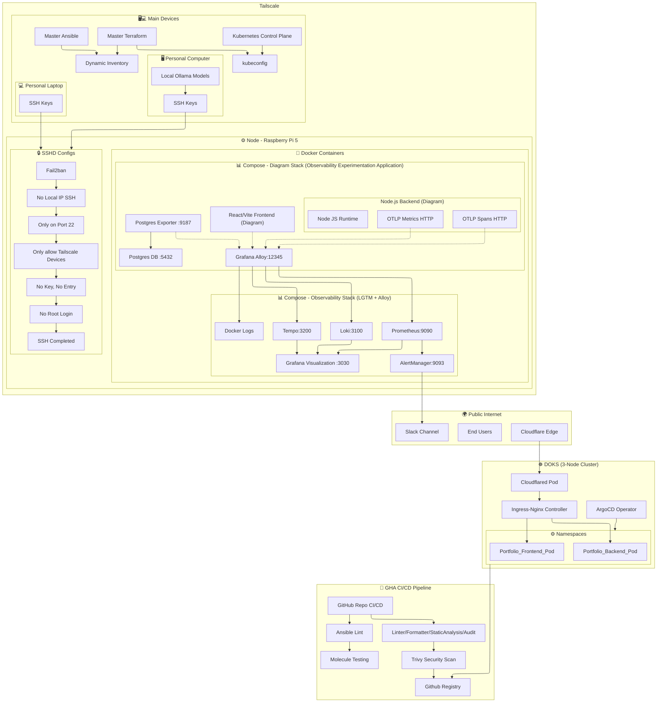

<!-- Header with dynamic stats and badges -->

  

<h1 align="center">Stephen Macabulos</h1>

  
  
  
  

  
  
  
  
  
  
  
  

  
  
  
  

---

## 🧑‍💻 About Me

2nd Year Computer Engineering student from the Philippines, driven by hunger and a will to do the work and learn.
I am very obsessed with tech and infrastructure and that's what keeps me to do what I do.

> Currently my infrastructure repo private for privacy and security reasons

🎯 Current Goal:
- Designing and Building Distributed System by using Kubernetes + Terraform + Cloud Providers
- Experiment on 3 Way Distributed Database load test, indexing, and migration.
- Applying High level System Design Concepts on Systems & Applications
- Studying networking fundamentals to reduce my weakpoints by building my own http engine.

---

  
  

📡 Click to expand full infrastructure diagram (June 13, 2026)

---

## 📝 Featured Blog Posts

_From my [portfolio blog](https://portfolio.seekeru.tech/blog)_

- 🔥 [**Telemetry Madness**](https://portfolio.seekeru.tech/blog/telemetry-madness) – _I let AI generate my observability stack, then watched it fail silently. Rebuilt from first principles with curl, Alloy, and an MVP OpenTelemetry app._
- ⏱️ [**SRE Steps**](https://portfolio.seekeru.tech/blog/sre-steps) – _Building a reliable kill script to measure real MTTD/MTTR in containerized infrastructure._
- 🛡️ [**Imposter Syndrome**](https://portfolio.seekeru.tech/blog/imposter-syndrome) – _Escaping the blackbox with the fundamentals._

---

## 📫 Let's Connect

I'm looking for **internship / entry‑level** opportunities (remote or hybrid).
or if you just talk in general about tech or even be my peer then you can message me! (I would be glad to)
Let's move forward together!

- 📧 [stpmacabulos@gmail.com](mailto:stpmacabulos@gmail.com)
- 🔗 [LinkedIn](https://linkedin.com/in/stephen-macabulos)
- 🌐 [Portfolio, Blogs & Infra](https://portfolio.seekeru.tech)
